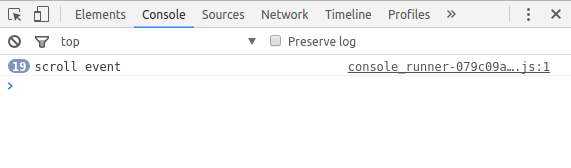
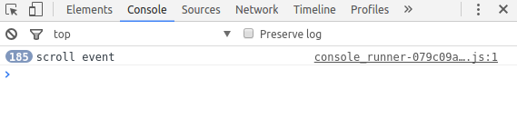
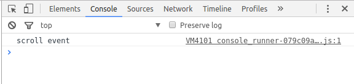

# jQuery事件處理技巧：Delay scroll (and resize)

## 目的：

- 優化 jQuery **scroll** 與 **resize** 的事件觸發
- 大幅減少重複的代碼，達到效能優化

> 參考文章：[delay-scroll-handlers-javascript](https://dannyvankooten.com/delay-scroll-handlers-javascript/)

底下文章皆以 **scroll** 事件為例：

## 情境：

我們在開發互動式網站時，通常 **scroll** 事件都是少不了的，現在很多 **UI** 的設計都會對 **滾動** 這個事件進行客制化，畢竟他是使用者與網站最主要的互動。

在程式端，如果你使用是 **jQuery** 一定都是使用 [.scroll()](https://api.jquery.com/scroll/)，來進行事件驅動，如下：

```{.language-javascript}
$(window).scroll(function(){
    console.log('scroll event')
})
```

不過其實這並不是一個好作法，因為當事件觸發時，你的代碼可能就會一次執行好幾次：

> scroll 事件觸發時，每 ms (微秒) 就會執行一次

我滾動了滑鼠滾輪 1 下：



我上下滾動滑鼠幾下：



看到上面驚人的執行次數，是不是很有感覺?

此時你的瀏覽器：


更何況有時候我們的代碼會執行一些叫複雜的運算，最典型的例子就是 **Ajax loading** 了，如果隨便滾個幾下就要執行 185 次的 **Ajax** ！？ 那絕對讓你網站慢的不要不要

## 主文：

### 作法：

接下來重點來了，我們該如何解決上述的問題，以下是我找到的答案：

```{.language-javascript}
var timer

$(window).scroll(function(){

    window.clearTimeout(timer);

    timer = window.setTimeout(function() {
          console.log('scroll event') //callback your coding
      }, 100);
})
```

滾動了滑鼠滾輪 1 下：



### 解析：

主要 methood ：

- [clearTimeout()](http://www.w3school.com.cn/jsref/met_win_cleartimeout.asp)
- [setTimeout)()](http://www.w3school.com.cn/jsref/met_win_settimeout.asp)

剛在前面說了：

> scroll 事件觸發時，每 ms (微秒) 就會執行一次

但這不是我們理想的結果，我們只需要使用者在滾動事件觸發後，執行 1 次 代碼就可以了，這段敘述也是這篇文章的目的

### Step 1 :

建立區域變數與 scroll 事件：

```{.language-javascript}
var timer

$(window).scroll(function(){})

```

### Step 2 :

將觸發事件綁定在 setTimeout() 內：

讓程式代碼不會每 1 ms (微秒) 就執行 1 次 ， 會變成每 1 ms (微秒)，就會有一個 100 ms (微秒)才執行的 setTimeout() 事件觸發

```{.language-javascript}
var timer

$(window).scroll(function(){

  timer = window.setTimeout(function() {
        console.log('scroll event') //callback your coding
    }, 100)

})
```

### Step 3 :

在 setTimeout() 之前加入 clearTimeout()事件：

在 step 2 時，在每 ms (微秒) 就會新增 1 個 100 ms (微秒) 的 setTimeout() 的任務在排隊，而在此步驟則是在每 ms 就會把先前新增的 setTimeout() 的任務清除，隨後在新增一個 setTimeout() 的任務

所以我們的代碼只會在最後一個 setTimeout() 裡才會被執行

```{.language-javascript}
var timer

$(window).scroll(function(){

    window.clearTimeout(timer)

    timer = window.setTimeout(function() {
          console.log('scroll event') //callback your coding
      }, 100)
})
```

## 結論：

雖然 scroll() 的事件在發生時，還是會每 1 ms (微秒) 就執行一次，但藉由以上的方法，可以上你的代碼在 scroll 事件停止的瞬間才會執行，光這點就能大大對網站有相當大的優化了。

當然同理的，這道理也適用 resize() 等等.. 事件
