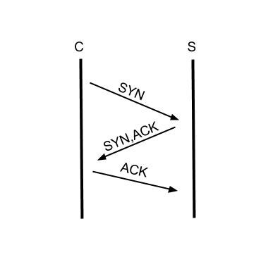

# 使用 node.js 建構 TCP Server

## 目的：

- 使用 node.js 建構簡單的 TCP server
- 藉由建制的過程初步運作與了解 TCP 所謂的 "三次握手"

## TCP 傳輸協定：

### 概述：

傳輸控制協定（英語：Transmission Control Protocol，縮寫為 TCP），是一種連接導向的、可靠的、基於位元組流的傳輸層通訊協定

### 運作方式 :

TCP用三路握手（three-way handshake）過程建立一個連線。

如圖示，分為三個階段：



- 第一階段：client端 向 server端 請求連線
- 第二階段：server端 向 client端 回應，告知 server 端 可以開始 傳輸資料
- 第三階段：client端 開始向 server端傳輸資料

> 這邊對於 TCP 的說明只是個概述，如想深入了解請閱讀 [傳輸控制協定](https://zh.wikipedia.org/wiki/%E4%BC%A0%E8%BE%93%E6%8E%A7%E5%88%B6%E5%8D%8F%E8%AE%AE)

## 使用 node.js 建構 TCP Server

Node.js 的 Net 模組 可以提供 一些網路傳輸的工具，包含製作 server端 與 client端口的應用

> 有關 node js net 的說明與方法資訊，請閱讀 [nodejs 官網](https://nodejs.org/api/net.html)

以下分 server端 與 client端 分開說明 ：

## Server 端 （建立 Server 端口）：

### step 1 : 引入 net module

1.在專案底下新增一個檔案為 server.js

2.引入 net 模組 :

```
var net = require('net')
```

### step 2 : 使用 net 模組建制 TCP server

使用 net.createServer() 的方法，建制新的 TCP Server :

```
//建立 net.createServer() 的物件
var server = net.createServer()

//用 net method listen() 方法讓 本機的 8124 port  給此 TCP server 使用
server.listen(8124, function () {
  console.log('TCP Server start')
})
```

> listen() 方法也可以針對 Domain name ， 詳情請閱讀 [nodejs 官網](https://nodejs.org/api/net.html)

### setp 3 : 事件綁定

在 step 2 已經透過了 net 的 module 裡的 method 其實你的 TCP server 就已經完成了，非常容易，不過為了體驗 TCP 三路握手（three-way handshake）， 在這個 step 裡我們將透過 net 提供的 method 來體驗

1.當 client端，向 server端 請求連線，並通知 client 可以開始傳輸資料的階段： （為 TCP 三路握手（three-way handshake）第二階段）

```
//使用 connection 事件
server.on('connection', function () {
  console.log('server端：收到 client 端連線請求，並通知 client 端可以開始傳送資料')
})
```

2.建立一個簡單的事件與 client端 互動 ：

```
var server = net.createServer(function (socket) {

  // data event： 到收到資料傳輸時觸發事件 ， argument 為對象傳輸的物件
  socket.on('data', function (data) {

    // write event: 傳輸資料的事件
    socket.write('hi', function () {
      console.log('server:收到 client端 傳輸資料為' + data + '回應 hi')
    })

  })
})
```

## Client 端 （建立 Client 端口）：

### step 1 : 引入 net module

1.在專案底下新增一個檔案為 client.js

2.引入 net 模組 :

```
var net = require('net')
```

### step 2 : 使用 net 模組建制 Client 端口

1.當 client端，向 server端 請求連線時的事件： （為 TCP 三路握手（three-way handshake）第一階段）

```
var client = net.connect({port: 8124}, function () {
  console.log('client端：向 server端 請求連線')
})
```

2.當 TCP Server 回應連線成功，通知可以開始傳輸資料的事件 為 TCP 三路握手（three-way handshake）第三階段）

```
// connect event : 與 server端 連線成功時的事件
client.on('connect', function (data) {
  console.log('client端：與 server端 連線成功，可以開始傳輸資料')
})
```

### setp 3 : 事件綁定

建立一個簡單的事件與 client端 互動

```
// write event: 傳輸資料的事件
client.write('hello！', function () {
  console.log('client端：開始傳輸資料，傳輸的資料為 hello!')
})

// data event： 到收到資料傳輸時觸發事件 ， argument 為對象傳輸的物件
client.on('data', function (data) {
  console.log('client端：收到 server端 傳輸資料為 ' + data.toString())

  //結束 client 端 連線
  client.end()
})
```

## 開始執行：
### step 1 : 執行 TCP Server

```
node server.js
```
執行結果：
```
TCP Server start
```

### step 2 : 執行 Client

```
node client.js
```

執行結果(Client)：
```
client端：向 server端 請求連線
client端：與 server端 連線成功，可以開始傳輸資料
client端：開始傳輸資料
client端：收到 server端 傳輸資料為 hi

```

執行結果(TCP Server)：
```
server端：收到 client 端請求，可以開始傳送資料
server:收到 client端 傳輸資料為hello！回應 hi

```

## 結論：
上述成果藉由自己動手，來對 TCP 傳輸控制協定有更進一步的理解，當然 TCP 事情遠不只這些，此教學只單單對 TCP 三路握手（three-way handshake）的事件進行說明，其餘還有很多如： Timeout,IP,Adress，等等諸多的協定與事件可以設定，個人認為從 TCP 入手，對於學習伺服器，和 http 等協定，是個還不錯的選擇
