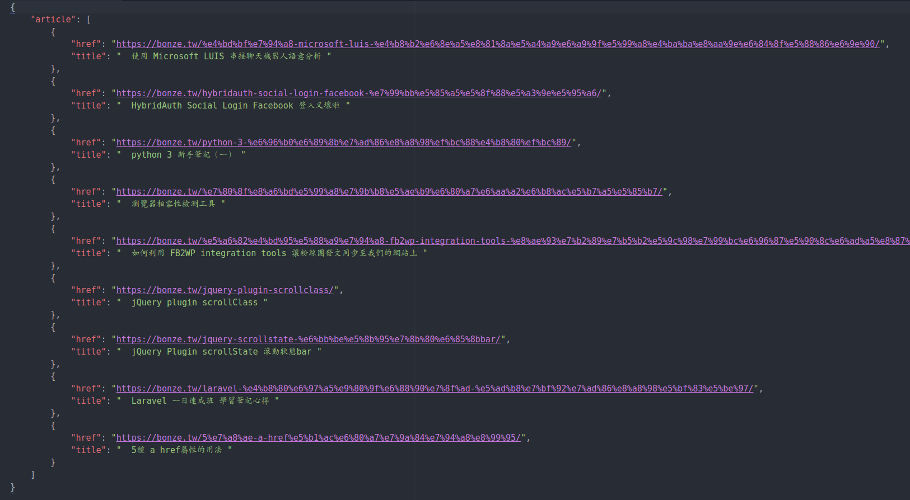

# python 簡易爬蟲筆記

## 目標 ：
存取指定網頁的 element 的 value 為 json 

## Step 1 安裝套件：

使用 pip3 安裝下列套件

### requests ：

> python 用來處理一般 service 請求的套件，相關資訊可查看 [requests 快速上手](http://docs.python-requests.org/zh_CN/latest/user/quickstart.html)

安裝 :

```
$ pip3 install requests
```

### beautifulsoup4 ：

> Beautiful Soup 是一个可以从 HTML 或 XML 文件中提取数据的 Python 库.它能够通过你喜欢的转换器实现惯用的文档导航,查找,修改文档的方式.Beautiful Soup 会帮你节省数小时甚至数天的工作时间.相關資訊可查看 [python：BeautifulSoup 模块使用指南](http://www.jianshu.com/p/2b783f7914c6)

安裝 :

```
$ pip install beautifulsoup4
```

### json :

> python 用來處理 json 格式的套件，python中自带了处理python的模块，使用时候直接import json即可。

## Step 2 開始 codding :

### 1\. 引入 python 要使用的模組：

```
import requests
import json
from bs4 import BeautifulSoup
```

### 2\. 使用 beautifulsoup4 模塊解析 來自 requests的url 的文檔，並使用 html.parser 解析器傳出結果：

```
res = requests.get('http://bonze.tw')
soup = BeautifulSoup(res.text, "html.parser")
```

### 3\. 建立陣列物件以來存取要抓取的資料：

```
obj =  {}
obj['article'] = []
```

### 4\. 使用迴圈個別抓取指定 element 的 value ， 且存取置張所建立的陣列物件:

```
for drink in soup.select('.article-field.title'):
    addItem = {'title': drink.get_text(),'href' : drink.find('a').get('href')}
    obj['article'].append(addItem)
```

### 5.最後將存取後的物件匯入到指定的json檔即可：

```
with open('bonze.json', 'w') as f:
     json.dump(obj,f,ensure_ascii=False,sort_keys = True ,indent = 4)
```

## 成果：



### 完整的coding:
```
# 引入 python 要使用的模組：

import requests
import json
from bs4 import BeautifulSoup


# 使用 beautifulsoup4 模塊解析 來自 requests的url 的文檔，並使用 html.parser 解析器傳出結果：

res = requests.get('http://bonze.tw')
soup = BeautifulSoup(res.text, "html.parser")


# 建立陣列物件以來存取要抓取的資料：

obj =  {}
obj['article'] = []


# 使用迴圈個別抓取指定 element 的 value ， 且存取置張所建立的陣列物件:

for drink in soup.select('.article-field.title'):
    addItem = {'title': drink.get_text(),'href' : drink.find('a').get('href')}
    obj['article'].append(addItem)


# 將存取後的物件匯入到指定的json檔
with open('bonze.json', 'w') as f:
     json.dump(obj,f,ensure_ascii=False,sort_keys = True ,indent = 4)
```
